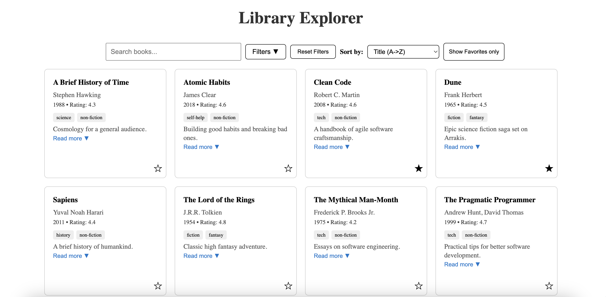

# Library Explorer

A small React + TypeScript project.  
The application loads a list of books, supports searching, filtering, sorting, and favorites — all implemented in a clean and user-friendly UI.

---
## Table of Contents
- [Overview](#Overview)
- [Running Instructions(locally or with Docker)](#Running-instructions)
- [Media Examples](#Media-Examples)

##  Overview
The app lets users:

- Load & display books from `books.json`  
- Search by **title** or **author**
- Filter by **tag** and **minimum rating**
- Sort by **title** or **rating**
- Mark books as ⭐ **Favorites**
- View **favorites only**
- See helpful **empty states** when no results match
- Enjoy full **TypeScript types**, accessibility features, and clean modular components

---
## Running instructions
### Download Instructions
1. Download the ZIP from GitHub (Code → Download ZIP)
2. Extract the folder anywhere on your computer
3. Open a terminal and move inside the project folder:
   cd library-explorer

###  Running Locally
1. Install dependencies:
```
npm install
```
2. Start the development server(default port:3000):
```
npm start
```
The app will run at:
```
http://localhost:3000
```
**Running on custom port:**

**macOS / Linux**
```
Port=400 npm start
```
**Windows (Powershell / CMD)**
```
set PORT=4000 && npm start
```
The app will run at:
```
http://localhost:4000
```

### Running with Docker:

 **1. Build the Docker image:**
```
docker build -t library-explorer .
```
**2. Run the container:**
```
docker run -p 3000:3000 library-explorer
```
the app will run at:
```
http://localhost:3000
```
**Run on a different port:**
```
docker run -p 8080:3000 library-explorer
```
the app will run at:
```
http://localhost:8080
```

---

##  Project Structure

```
public/
 |- books.json
src/
 ├─ components/
 │   ├─ BookCard/
 │   ├─ FilterBlock/
 │   ├─ SearchBlock/
 │   ├─ SortBlock/
 │   ├─ FavToggle/
 │
 ├─ types.ts
 ├─ App.tsx
 ├─ App.module.css
 |─ index.tsx
 |- Dockerfile 
```

---


## Media Examples

<div align="center">

###  Sorted


###  Search


###  Filtered


###  Favorites Only


</div>

---

**If you have any questions:**  
Oded didi : odeddidi@gmail.com

